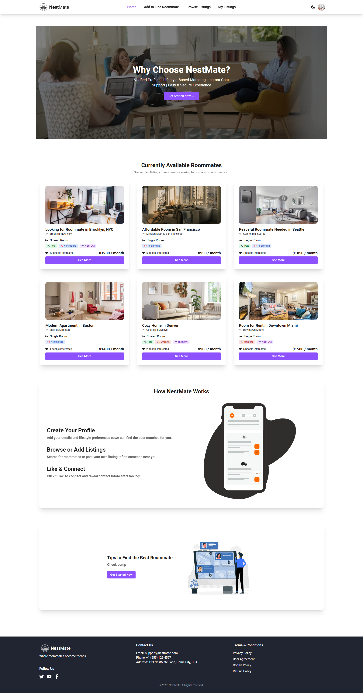

# Nest Mate - Roommate Finder Website 🏠

A platform to help individuals find compatible roommates based on location, budget, lifestyle preferences, and interests.

---

# 🌈 Project Overview
NestMate is a full-stack web application designed to help users find suitable roommates based on shared interests, preferred locations, and affordable living costs. Users can add and browse listings to match with compatible roommates—making shared living smarter and stress-free.

---

# 🚀 Live Demo
Live Site: [https://nest-mate.web.app/](https://nest-mate.web.app/)  
Server: [https://nest-mate-server.vercel.app/](https://nest-mate-server.vercel.app/)

---

# ✅ Features Implemented

- 🔐 **Authentication**: Login and SignUP with Email/Password or Google.
- 🛡️ **Private Routes**: Add, Update, and View own roommate listings securely.
- ➕ **Add Roommate Listing**: Users can add their roommate listing with title, rent, lifestyle preferences, and more.
- 🔍 **Browse Listings**: Explore all available roommate posts in a table view.
- 📋 **My Listings**: View, edit, or delete your own roommate posts.
- 📝 **Details Page**: View full post info, like a listing, and see contact info after liking.
- 📱 **Responsive Design**: Works smoothly across mobile, tablet, and desktop.
- 💬 **Toast Notifications**: All actions show success/error messages using toast.
- 🌗 **Dark/Light Mode Toggle**: Switch between themes for better user experience.
- 🔄 **Loading Spinner**: Displayed while data is being fetched.
- 🧾 **404 Page**: Custom page for invalid routes.
- 🎞️ **Lottie Animations & Typewriter Effect**
- 🧭 **Tooltip and SweetAlert2 support**

---

# 🧰 Technologies Used

## 🛠️ Main Technologies
- React — Frontend UI library
- React Router v7 — Client-side routing
- Firebase Authentication & Firestore — User auth and real-time database
- Tailwind CSS + DaisyUI — Styling and UI components
- Node.js & Express.js — Backend server and API
- MongoDB — Database for listings and user data
- Cloudinary — Image upload and hosting
- Vercel & Render — Deployment platforms

## 📦 Dependencies Used
- react-hot-toast — Toast notifications
- react-icons — Icon library
- react-slick / swiper — Slider/carousel components
- lottie-react — Animation support with Lottie
- react-simple-typewriter — Typing effect text animation
- react-tooltip — Tooltip components
- sweetalert2 — Beautiful alert dialogs

## Dev Tools:
- Vite
- ESLint
- daisyui
- globals
- @vitejs/plugin-react

---

# 📦 Packages Used (from package.json)

| Category   | Package                                     |
| ---------- | ------------------------------------------- |
| Auth/      | `firebase`                                  |
| UI         | `tailwindcss`, `daisyui`                    |
| Animations | `lottie-react`, `react-simple-typewriter`,  |
|            | `react-tooltip`,`sweetalert2`               |
|            |                                             |
| Backend    | `express.js`,  `mongoDB`                    |
| Routing    | `react-router`                              |
| Toasts     | `react-hot-toast`                           |
| Icons      | `react-icons`                               |
| Slider     | `react-slick`, `slick-carousel` or `swiper` |
| Build Tool | `vite`, `@vitejs/plugin-react`              |


---

# 📝 Notes

- Firebase is used for authentication and database
- Environment variables stored in `.env`
- Styled with Tailwind CSS & DaisyUI
- No Lorem Ipsum – all text meaningful and relevant
- Toast notifications used instead of alerts
- Responsive layout with mobile-first approach

---
<br/>

# 🧪 NestMate - Local Development Setup Guide
Follow these steps to run the NestMate project on your local machine.

## Prerequisites
- Node.js (v16 or higher recommended)
- npm or yarn
- Git


## Step-by-Step Installation
1. **Clone the repository**
   ```bash
   git clone https://github.com/ArunRoy404/NestMate-Client.git
   cd NestMate-Client
   ```

2. **Set up environment variables**
    Create a .env file in the root directory and add the following variables with your own credentials:

    ```bash
        VITE_apiKey=YOUR_FIREBASE_API_KEY
        VITE_authDomain=YOUR_FIREBASE_AUTH_DOMAIN
        VITE_projectId=YOUR_FIREBASE_PROJECT_ID
        VITE_storageBucket=YOUR_FIREBASE_STORAGE_BUCKET
        VITE_messagingSenderId=YOUR_FIREBASE_MESSAGING_SENDER_ID
        VITE_appId=YOUR_FIREBASE_APP_ID
    ```

    You'll need to:
    - Create a Firebase project at https://firebase.google.com/
    - Get an ImgBB API key at https://imgbb.com/
    - Set up Stripe at https://stripe.com/


3. **Install dependencies**
   ```bash
        npm install
        # or
        yarn install
   ```
    
4. **Run The Development Server**
   ```bash
        npm run dev
        # or
        yarn dev
   ```

5. **Access the application**
    Open your browser and visit: http://localhost:5173

---

# 🖼️ ScreenShot 
<p align="center">
    
</p>